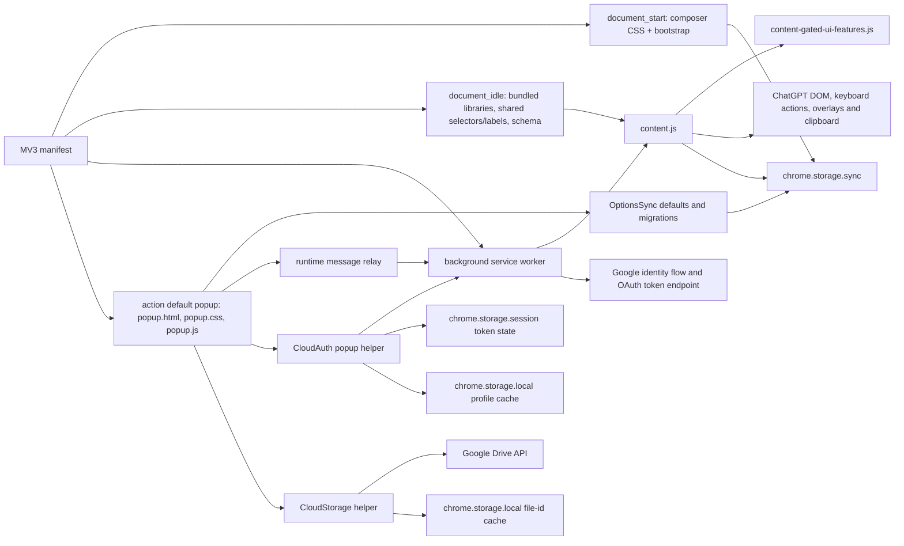

# Audit 0087 — Coverage and Batch 01 checkpoint

## Checkpoint

- Batch 01, Architecture and baseline: complete on 2026-09-29.
- Current audit register state: no earlier coverage, findings, or recovery ledger existed; this batch initializes them.
- No source, test, fixture, package, permission, browser setting, or user data was changed. Command evidence consists of the bounded validator transcript and the source fingerprint map.
- Repository root: current checkout.
- Environment: local Windows checkout; Node v24.15.0 and npm 11.12.1 resolved. No dependencies or browsers were installed.
- Browser readiness: the repository documents CodexCleanProfile and CDP ports 9333/9222/9223. No endpoint, login, active tab, or browser behavior was probed in Batch 01. Availability and authorization remain unverified.
- Source snapshot time: 2026-09-29 07:01 UTC. Full SHA-256 map: [Batch 01 source fingerprints](evidence/batch-01-source-fingerprints.sha256).

## Proof vocabulary

- Static source proof describes declarations and code paths only.
- Isolated-test proof requires an executed test or fixture and its result.
- Live-browser proof requires an observation in the browser. A static validator or popup screenshot harness is not live-browser proof.
- Statuses are scoped to the specific proof row; a pass in one category does not imply a pass in another.

## Architecture graph

The graph is a source map, not a runtime trace. The four bundled GSAP references and the vendor options-sync implementation were not opened. The model-picker default arrays are 15 entries; the source describes 15 as compatibility padding, while catalog/key arrays can grow. Dynamic model-catalog behavior is assigned to Batch 03/04.

## Component coverage

| Component/interface | Owner batch | Batch 01 static source proof | Isolated-test proof | Live-browser proof | Source fingerprint IDs |
| --- | --- | --- | --- | --- | --- |
| Manifest, action popup, content-script registration and execution phases | 02 | Entry points and order mapped; permission/CSP and action reachability claims still need official verification | Not run | Not probed | FP-001 |
| Early composer layout bootstrap and stylesheet | 04 | document_start files and sync-setting edge mapped | Not run | Pending layout/reload observation | FP-002–003 |
| Background worker, action-window helper and message broker | 02/03 | Action/window helpers, message types, storage/network edges mapped | Not run | Pending only where required; no auth or tab mutation attempted | FP-004 |
| Main ChatGPT page runtime, GSAP reference set (bodies not read), and shared model-picker selectors/labels | 03/04 | Manifest dependencies and DOM/storage/clipboard roles mapped | Not run in this audit | Pending page behavior and current selectors | FP-001, FP-005, FP-012–013 |
| Gated UI features and route/storage listeners | 04/05 | Separate runtime entry and storage/observer role mapped | Not run | Pending lifecycle, UI and state observations | FP-006 |
| Popup HTML, CSS/controller and referenced OptionsSync library (body not read) | 05 | Linked resources, script order, sync writes, message and backup/cloud entry points mapped | Visual harness inspected but not run | Native popup behavior pending | FP-007–009 |
| Settings defaults, migration, schema, model catalog/profile contract | 03/05 | Defaults, schema roles, 15-slot initial arrays, nullable catalogs and compatibility-padding note verified | Static validator passed; it does not prove live behavior | Persistence/round-trip behavior pending | FP-010–012 |
| OAuth and settings Drive helpers | 02/03 | Popup → CloudAuth → background broker and CloudStorage boundaries mapped | Not run | No live login, logout, upload, restore or token mutation | FP-015–016 |
| Packaging controls, locale/icon references and dependency declarations | 02/05 | Manifest refs, build inclusion/exclusion lists, asset paths and package scripts inventoried | No archive built | No store/archive check | FP-001, FP-026–027, FP-033–042 |
| Developer shortcut metadata, DevScrape report/helpers, analytics/Aptabase dependency and usage-report surfaces | 02/06 | Source references and separation from ordinary entry points mapped; packaged reachability remains for Batch 02 | No DevScrape command run | Not probed | FP-014, FP-017–025 |
| Validator, fixtures, Playwright entry points and browser setup documentation | 01/03/04/05 | Entrypoints inventoried; validator scope and screenshot harness limits reviewed | validate:keys passed; other tests not run | Session/profile availability not probed | FP-028–032 |

## Major user-flow coverage and proof obligations

| Flow | Current source path/interface | Owner batch(es) | Required proof and current status |
| --- | --- | --- | --- |
| Extension startup and page readiness | manifest → early composer CSS/bootstrap → idle shared dependencies/schema → content runtime → gated UI | 02, 04 | Static load-order proof mapped. Verify current Chrome lifecycle/API claims in 02 and page initialization/cleanup in 04. Live page proof pending. |
| Settings hydration and control changes | popup/data-sync controls → OptionsSync defaults/migrations and settings schema → chrome.storage.sync → content/gated consumers | 03, 05 | Static wiring baseline passed. Migration, error/recovery and runtime-consumer behavior pending. |
| Shortcut dispatch and model/effort switching | popup assignments and shared model metadata → content handlers/selectors → ChatGPT controls; popup can relay messages through the worker | 03, 04, 05 | Source paths mapped. Existing focused fixtures are inventory only here; run only those selected by later batch plans. Live dispatch and model UI proof pending. |
| Copy and clipboard actions | content/gated UI actions → ChatGPT DOM and Clipboard API | 04 | Source boundaries mapped. Failure cases and safe browser semantics pending; no clipboard operation was performed. |
| Overlay and page UI/layout adjustments | content runtime and gated features → page DOM; overlay markup dynamically references popup.css; composer bootstrap styles early layout | 02, 04, 05 | Source paths mapped. Popup stylesheet reachability is a Batch 02 question; CSS parity, lifecycle, accessibility and live layout proof remain pending. |
| Settings file backup import/export | popup backup code → settings storage/defaults and export allowlist → file picker/download | 03, 05 | Entry points located. Synthetic payload, allowlist, round-trip and recovery proof pending; no user settings were exported or imported. |
| Optional Google login and Drive sync | popup → CloudAuth → background identity/OAuth broker → token endpoint; CloudStorage → Google Drive; session/local/sync storage | 02, 03 | Trust/data boundaries mapped. Official API/security review and isolated failure cases pending. Live login/logout and Drive writes are outside the allowed probes. |
| Action popup lifecycle and action shortcut | manifest default popup and _execute_action declaration; worker also registers an action click handler that opens an actionWindow URL | 02, 05 | Static declarations mapped. Whether Chrome dispatches that handler and whether the alternate-window path is user-relevant require official documentation and source-flow review. Native popup lifecycle remains pending. |
| Developer reporting and analytics/usage surfaces | DevScrape helper/report files, analytics source, usage-report files; optional global lookup in background | 02, 06 | Source and archive reachability classification pending. No audit scrape, report command, analytics request, or archive build was run. |

## Batch 01 baseline and harness limits

- Command: npm run validate:keys — exit 0. Transcript: [batch-01-validate-keys.txt](evidence/batch-01-validate-keys.txt).
- Result: “Settings wiring validation passed”; 66 popup-backed controls and 13 supplemental keys validated; prototype checks passed for clickToCopyInlineCodeEnabled and shortcutKeyShowOverlay.
- Fingerprint map validation: first pass exit 1 caught malformed FP-021; corrected without changing source. Final pass exit 0 verified all 42 entries. See [fingerprint-map validation](evidence/batch-01-fingerprint-check.md).
- The validator is static wiring proof only; it does not execute Chrome, inspect the ChatGPT DOM, or prove end-to-end behavior.
- Node and npm were available at the versions above. Package scripts list the focused validator, popup visual, and ChatGPT Playwright entry points. No install was attempted.
- Package entrypoints mapped: validate:keys (static validator); test and test:popup-visual (the popup visual suite); playwright:chatgpt:* and audit:selectors (browser/scrape flows); zip (release archive write, outside this audit). Only validate:keys ran in Batch 01.
- The popup visual test launches a disposable persistent Chromium context, loads the extension, injects CSS that removes popup height/overflow constraints, resizes the viewport, and cleans its temp profile in finally. It cannot alone prove native action-popup dimensions, close/reopen behavior, focus or persistence. The screenshot test was not run.
- The setup note documents a dedicated CodexCleanProfile and CDP 9333 with 9222/9223 fallbacks. Documentation is not evidence those endpoints, browser binaries, authentication or an authorized live session are currently available.

## Batch 02 verification lead dispositions

1. The popup.css page-resource request is blocked by the current no-WAR manifest rule; tracked as CSP-AUD-002. Confirm visual impact in Batch 04.
2. Chrome suppresses action.onClicked when default_popup is set. The alternate action-window helper is not the toolbar-click path; no current user-facing loss was established.
3. system.display.getInfo is permission-gated, but the code catches the failure and falls back. The same alternate window path is suppressed by default_popup; no current user-facing impact was established.
4. URL-filtered tabs.query calls remain in fallback paths. Chrome ignores URL filters without tabs permission or host access for the page; the declared ChatGPT content-script match supplies matching origin access. No browser query was performed and no defect was promoted.
5. The optional CSPUsageAnalytics source is not loaded by manifest or popup and its source/SDK/report files are excluded by build rules. Source/build evidence supports the no-analytics release posture; the ZIP remains uninspected.
## Batch 01 closeout and next input

- Batch 01 acceptance: passed. Components and major flows have owner batches, source interfaces and proof obligations; static/test/live proof are separated; the baseline result and environment are recorded.
- Files changed in Batch 01: this coverage file, the findings register, the fingerprint/validator evidence files, and the active plan checkpoint. No implementation files changed.
- Recovery: no audit-owned browser state was changed, so no restoration obligation was created.
- Batch 02 consumes this graph, the static baseline, the fingerprint map and the listed official-documentation/reachability questions.
- Source changes during later batches invalidate only implicated fingerprints and reopen their owning evidence gate.

## Batch 02 — Trust, permissions, privacy, and packaging (2026-09-29)

### Trust and data-flow matrix

| Source → receiver | Guard and payload boundary | Data/effect | Current classification |
| --- | --- | --- | --- |
| Popup CloudAuth → background worker, cloudAuth.login | Popup requests only the optional identity permission in a click handler. Worker checks identity, generates a 128-bit random state, uses chrome.identity.getRedirectURL(), verifies returned state, and requires an authorization code. The background listener does not restrict sender URL; this is internal extension messaging, and the manifest has no externally_connectable declaration. | Requests only Google Drive appData scope. Initial code and later refresh-token grants are posted to the Netlify broker. Access and refresh tokens are held in chrome.storage.session. | Flow is source-reachable, but the cross-origin broker fetch lacks declared host access; see CSP-AUD-001. No auth or network request was performed. |
| Popup CloudStorage → Google Drive | Storage helper requests an access token, limits sync data to keys in OPTIONS_DEFAULTS, and excludes model catalog/name snapshots. | Reads/writes extension_settings.json in appDataFolder; caches the file ID in chrome.storage.local. | Data scope is narrow in source. Direct Google API fetches also lack declared host access; see CSP-AUD-001. No Drive data was read or written. |
| Popup → background relay → ChatGPT content script | Popup first tries tabs.sendMessage and otherwise sends csp.relayToChatGptTab. The worker resolves a candidate and checks the tab URL against ChatGPT before sending. The content listener handles four known model-picker message types; action IDs are looked up before dispatch, and boolean options are read explicitly. Runtime errors are returned as structured failures. | Refreshes model catalogs, releases a prepared model-config session, or triggers a validated model action in the ChatGPT page. | Internal extension route. The worker does not verify the relay sender URL, but the manifest has no external-message entry point and the content handler limits effects. No rejected-sender fixture was found. |
| Background csp.relayToSenderTab → originating tab | Requires sender.tab.id, but forwards its payload without a schema. No shipped popup producer exists; the only other matching producer found is in the developer Playwright helper. | Relays an extension message back to the sender tab. | Dormant in the ordinary packaged UI; not promoted to a product finding. Developer helper is outside the package. |
| Page postMessage → fast-preview bridge | The bridge checks event.source and a string marker, which a page script could forge if active. Its containing IIFE returns immediately because ENABLE_FAST_PREVIEW_OVERLAY is false. | Would fetch/render conversation preview text; the renderer uses textContent for title and segments. | Inactive source, not a current page-to-extension data path. If re-enabled, the marker is not an authentication boundary. |
| ChatGPT settings/catalog data → shortcut overlay markup | Localized labels are HTML-escaped and ordinary file import normalizes shortcut values. Cloud restore instead passes profile arrays through a deduplication helper that accepts arbitrary strings; the overlay later interpolates the display value into an input attribute. | Generates overlay DOM inside ChatGPT's page. | Conditional stored-markup injection path; see CSP-AUD-004. No payload was executed. |
| Background → popup cloudAuth.loggedIn | Broadcast contains only the event type; popup listener refreshes its auth view. | No token/profile data is included in the message. | No sensitive message payload observed. |

### Package inventory

| Source surface | Build-script rule | Inventory result |
| --- | --- | --- |
| Manifest worker, action popup, action/extension icons, manifest content scripts, popup local scripts/styles, and default English locale | Root files are explicit includeItems; lib, shared, vendor, and _locales are recursively included | All checked references exist and are selected by the build script. The four GSAP files and vendor webext-options-sync are included by those rules. |
| popup.css linked dynamically from the ChatGPT shortcut overlay | Explicit popup.css includeItem | File exists and the build script would include it, but the manifest has no web_accessible_resources rule for page-origin access. Chrome's resource-access rule confirms the page request is blocked; live visual impact remains assigned to Batch 04. |
| Developer-only scripts | lib/DevScrapeWide.js, lib/DevScrapeNarrow.js, and shared/shortcut-action-metadata.js are exact exclusions; extension/dev-scrape is not an includeItem | Excluded by the current script. |
| Analytics and usage-report surfaces | analytics.js and usage-report files are not includeItems; vendor/aptabase-browser/ is an excluded prefix | Source files exist, but no manifest/HTML load path was found and the build rules omit them. background.js only makes optional global lookups; it does not import analytics.js. No-analytics release posture matches spec 0007 at the source/build-rule layer. |
| Actual release archive and store listing | Not inspected | No ZIP was built or opened; no Chrome Web Store listing/dashboard review was performed. Membership statements above are inferred from build-zip.js, not an archive observation. |

### DOM and message review

- The popup's HTML-capable duplicate modal is called with fixed confirmation markup in two locations; its general string path escapes text. Popup status uses textContent. The toast helper writes HTML, but the call sites inspected provide fixed/localized text or Chrome storage/runtime error strings; no page-controlled flow into a toast was established.
- Shortcut overlay labels use escapeHtml. The key display value is not escaped before insertion into an HTML attribute; cloud restore does not validate values as KeyboardEvent.code. Ordinary settings-file import does call normalizeShortcutVal, so the cloud restore path is the lower-trust exception recorded in CSP-AUD-004.
- Conversation copy builds detached HTML from cloned ChatGPT DOM for the user-requested clipboard operation. No live-page execution sink was established by the static trace; clipboard/runtime behavior remains in Batch 04.
- A targeted search of tests found no isolated rejected-sender or malformed-background-message security fixture. No test was run. Existing model-catalog fixtures assert wiring only.

### Static checks and limits

- The manifest parsed successfully with a read-only Node check after stripping its UTF-8 BOM. The first plain JSON.parse attempt stopped on the BOM; this was a reader issue, not malformed manifest JSON. Manifest version is 3, version 4.7.0.2, required permissions are storage, optional permissions are identity, and host_permissions, optional_host_permissions, and web_accessible_resources are absent.
- Every manifest-referenced local script, stylesheet, icon, popup local resource, English locale path, and the dynamic popup.css path checked exists and is selected by the build script.
- node --check extension/background.js exited 0.
- package.json has no runtime dependencies. Its eight devDependencies resolve in package-lock.json v3 to @biomejs/biome 2.3.2, @playwright/test 1.58.2, acorn 8.18.0, archiver 7.0.1, cheerio 1.1.2, playwright 1.58.2, strip-json-comments 3.1.1, and webext-options-sync 4.3.0. No package was installed and no dependency audit was run; bundled vendor bodies were not inspected.
- Official Chrome and Chrome Web Store source notes are in evidence/batch-02-official-docs.md. Machine-readable check notes are in evidence/batch-02-static-checks.txt.
- Browser permission state, network errors, popup overlay rendering, OAuth state handling against Google, actual ZIP membership, and live policy publication remain unverified. No authentication, network request, or user/browser state mutation was performed.

## Batch 03 — Runtime and data reliability (2026-09-29)

### Checkpoint

- Status: [x]. Static source review and focused checks are complete. A fresh disposable Playwright Chromium profile loaded the unpacked extension, opened its native action popup, changed one sync-backed setting, closed/reopened the popup, verified persistence, restored the original storage/UI state, and removed the profile. Batch 03's required browser lifecycle gate passes; Batch 04 may start.
- The original 42-entry fingerprint map remains unchanged as the Batch 01 baseline. A post-repair check verified the other 41 source entries still match; FP-005 (`extension/content.js`) changed only through the user's authorized shortcut repairs. Old and current digests are recorded in evidence/batch-03-post-repair-fingerprint.md.
- The separately requested changelog review used the last clean commit deaa132 (2026-09-28 19:08:38 -0700). The user's “+1263 changes” label reconciled exactly at that review point: 875 tracked insertions plus 523 lines in 11 untracked plan/audit files minus 135 tracked deletions, for net +1,263. Full source-diff review identified seven user-facing changes for September 29: Fade Slim Sidebar behavior; distinct dictation control targeting; Stop and Transcribe shortcut; Send Edit Alt+G; Edit Message Alt+M; theme-aware Highlight Bold Text colors; and Branch in New Chat targeting the selected response's own actions menu. The missing Branch item was added. The later Ctrl+Enter source repair was also added to today's changelog. The user reports Ctrl+Backspace still fails in the real UI, so its tentative changelog entry was withdrawn pending evidence from ChatGPT's active Stop control. Current working-tree delta after subsequent audit and shortcut artifacts: 903 tracked insertions and 142 deletions across 27 files, plus 1,494 lines in 19 untracked files, for net +2,255. Search Conversations and Branch in New Chat were already covered by September 28 entries; the rest is internal tests, audit harnesses, plans, specs, and evidence.

### Settings and data contract

| Producer → consumer | Boundary and persistence | Static result |
| --- | --- | --- |
| Popup controls → optionsStorage → extension contexts | OPTIONS_DEFAULTS is the canonical key/default set and storageType is sync. Edit Message and Send Edit defaults are KeyM and KeyG in the popup override and m/g in storage defaults; Stop and Transcribe Dictation is present with the blank placeholder in both. Schema labels and overlay key membership are present. | `npm run validate:keys` passed for 66 popup-backed controls and 13 supplemental keys. In a fresh disposable profile, the actual Chrome action popup toggled `enableSendWithControlEnterCheckbox`, persisted it to sync storage, rehydrated it after close/reopen, then restored and verified its original value. A DOM `.click()` in the popup target drove the control because the CDP target reported a zero-sized layout box; physical mouse interaction was not tested. |
| Popup CloudAuth → background login broker | The popup requests only optional identity from a click. The worker checks permission, creates and verifies OAuth state, obtains the code using launchWebAuthFlow, and exchanges it with the broker. Access, refresh, and expiry values use chrome.storage.session; the optional profile record uses chrome.storage.local. | State and token ownership are traceable in source. Chrome documents that storage.session survives worker dormancy but is cleared when the extension is disabled, reloaded, updated, or Chrome restarts. Sign-in after those events was not live-tested. |
| Local settings → Drive save | CloudStorage derives its key allowlist from OPTIONS_DEFAULTS, excludes scraped model catalogs/names, reads from sync storage, and caches the Drive file ID in local storage. The current popup caller passes the filtered local payload to saveSyncedSettings. | The payload scope is source-limited for the current caller. saveSyncedSettings itself serializes its argument without reapplying pickOptions, so its allowlist guarantee depends on callers. No request was sent. |
| Drive restore → local settings → popup | Remote JSON is filtered through pickOptions, written through optionsStorage.setAll, then reflected into controls and the independent latest/legacy model-picker profiles. The profile write in rehydrateSettingsUI is a separate unawaited chrome.storage.sync.set. | Key boundaries and intended profile separation are visible. Runtime completion order, quota failure on the second profile write, and popup-close behavior remain unobserved. The Cloud profile-code path still lacks the KeyboardEvent.code validation used by file import; see CSP-AUD-004. |
| Settings file export/import | Export uses the popup allowlist and excludes scraped model state. Import accepts recognized keys only, normalizes shortcut values and profile arrays, merges into current sync settings, and checks chrome.runtime.lastError. Invalid JSON is caught and reported as an import error. | The settings wiring validator and existing backup-filter fixture pass. Import side effects were not exercised in a browser. |
| Background auth/message work | Auth data is stored in extension session storage rather than worker globals. Background message handlers retain asynchronous responses; existing Batch 02 coverage records the relay guards and retry behavior. | Worker restart can recreate the worker without losing session data, but fetch and interactive-auth duration limits remain relevant; see official source notes. No message was sent to a ChatGPT tab. |
| Popup → ChatGPT content messages | Popup tries the source/current tab, retries only when no receiver exists, then relays through the worker. The worker validates preferred and remembered IDs against a ChatGPT URL, falls back to a URL-filtered tab query, and retries a missing receiver once. | Stale IDs fall through to a verified candidate or NO_CHATGPT_TAB; send failures return structured errors. No message was sent and no receiver-failure fixture exists. The CSP_TRIGGER_MODEL_ACTION handler responds when work is queued rather than when it finishes, but no shipped producer was found, so this is not treated as a current user-facing defect. |

### Failure and recovery matrix

| Condition | Source behavior | Evidence / remaining boundary |
| --- | --- | --- |
| Token expires according to stored expiry | A noninteractive request returns no token. On a user action, auth.js attempts the stored refresh token; if refresh fails, it falls through to full login. | Static trace only. If the server rejects a still-unexpired token, storage.js requests its removal from Chrome Identity's cache, but CloudAuth still holds the broker token in storage.session and returns it while its recorded expiry is future. See CSP-AUD-005 and CSP-AUD-006. |
| Drive update returns 401/403 twice | updateFile returns an unauthorized marker. saveSyncedSettings retries, but after the retry checks only notFound and returns success for the remaining unauthorized marker. | Confirmed source path; no Drive request was made. The popup then displays Saved to cloud. CSP-AUD-005. |
| Drive restore returns 401/403 twice | With a cached file ID, loadSyncedSettings converts the final unauthorized marker to an empty filtered object. The popup treats an empty object as No backup found. | Confirmed source path; no Drive request was made. CSP-AUD-006. |
| Cached Drive file ID is stale | Update 404 clears the local ID and falls through to create. Restore 404 on the cached-ID path clears the ID and lists again. A race where a listed file disappears before download can still produce an empty response and cache that ID for one attempt. | Static trace. No remote files or IDs were read or changed; the race is not promoted beyond a residual risk. |
| Malformed settings file or Drive JSON | File import catches JSON.parse errors and shows the invalid-import toast. A Drive response JSON parse rejection propagates to the popup restore catch before local settings are written. | Static trace; malformed file/response was not injected. |
| Sync storage quota or write failure | File import checks runtime.lastError; Cloud restore awaits saveLocalSettings and reports a thrown write failure. The later model-picker profile rewrite is unawaited and has no rejection handler. | Static trace. No quota limit was induced; the profile rewrite limitation is recorded as a risk, not a confirmed user failure. |
| Save and Restore overlap | Each handler disables only its own button. Both share one status element and both read/write the same Drive file or sync settings; there is no shared operation lock. | Static concurrency risk; no browser timing proof. See CSP-AUD-008. |
| Popup closes during pending async work | Local/Drive writes are awaited by handlers, but the popup owns the UI response and may close before the status update or rehydration completes. | A completed local-setting write survived an actual popup close/reopen round trip. Closing while a write is still pending was not simulated; no Drive request or personal-profile setting was used. |
| Worker suspends or broker is slow | Auth tokens are in storage.session, not worker globals. Chrome documents a 30-second fetch-response limit and a five-minute single-event/API-call processing limit for extension workers. | API behavior is documented; slow broker/network behavior and recovery were not exercised. |
| Latest/legacy profile arrays and scraped snapshots | Both profile arrays are included in OPTIONS_DEFAULTS and the cloud allowlist; scraped model catalogs/names are excluded. File export/import preserves the profile arrays separately and normalizes imports. | npm run validate:keys passed; tests/model-catalog-backup-filter-fixture.mjs passed. No cloud round trip was performed. |

### Batch 03 proof status

- Static checks and isolated filter proof are recorded in evidence/batch-03-static-checks.txt. Current Chrome API sources are recorded in evidence/batch-03-official-docs.md. Disposable popup lifecycle evidence is in evidence/batch-03-popup-close-reopen-result.md.
- No auth, Drive, account, or personal Chrome profile was accessed. The fresh profile was created, used, and removed by the harness. The popup persistence round trip passed; live Drive verification remains unperformed and requires separate authorization, and must not upload real settings.
- A separate current-checkout runtime probe loaded the real extension on `chatgpt.com` and confirmed the Control+Backspace route against a synthetic visible Stop target; it does not verify ChatGPT's actual Stop-button markup. Details and that boundary are in evidence/batch-03-control-backspace-extension-probe-result.md.
- Batch 03 is complete. Batch 04 may proceed; Batch 05 remains pending its planned turn.
